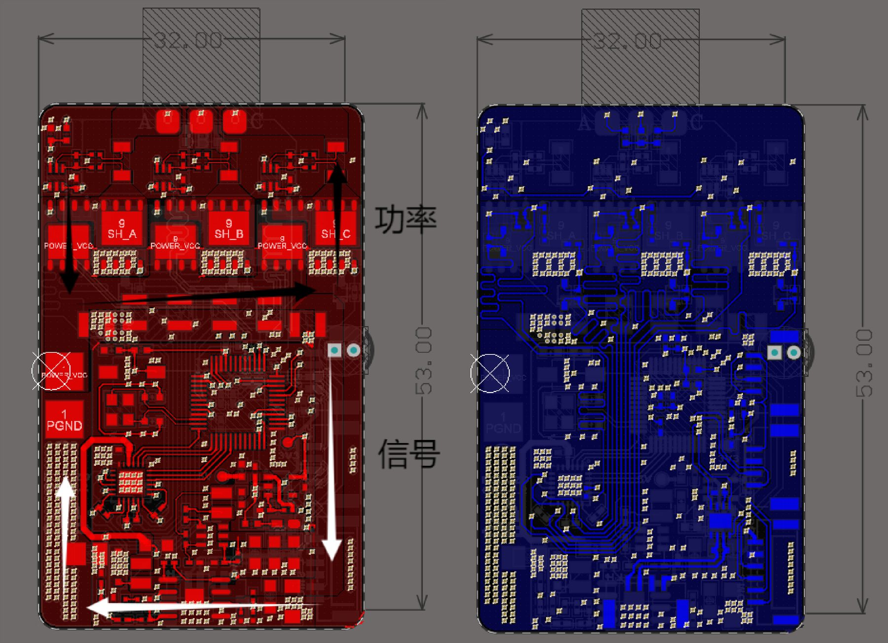
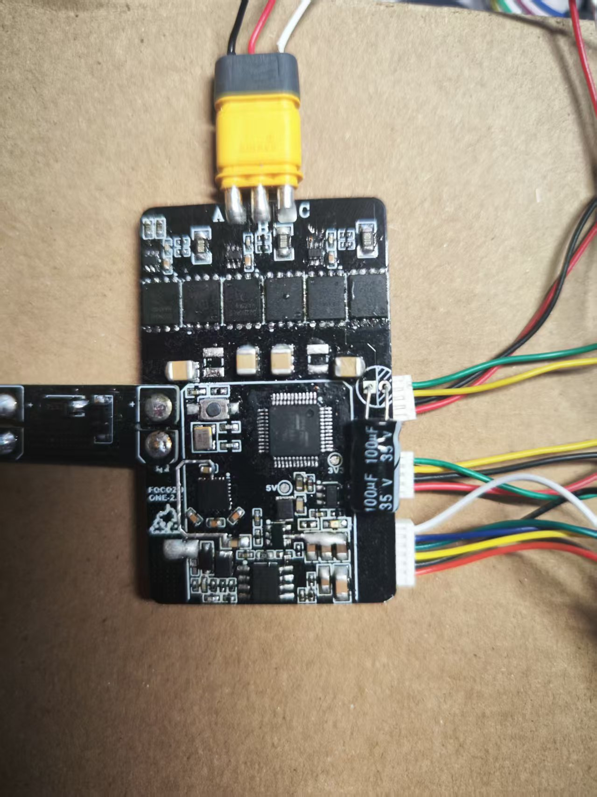
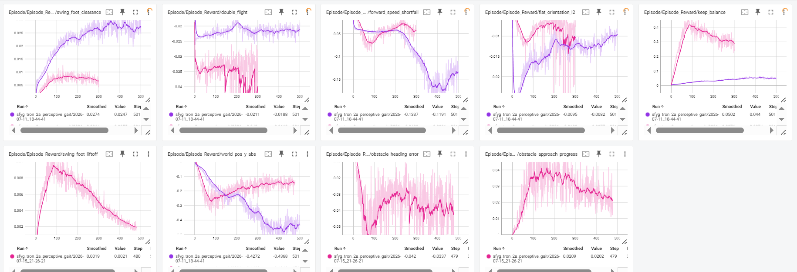
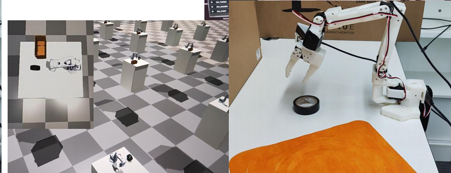
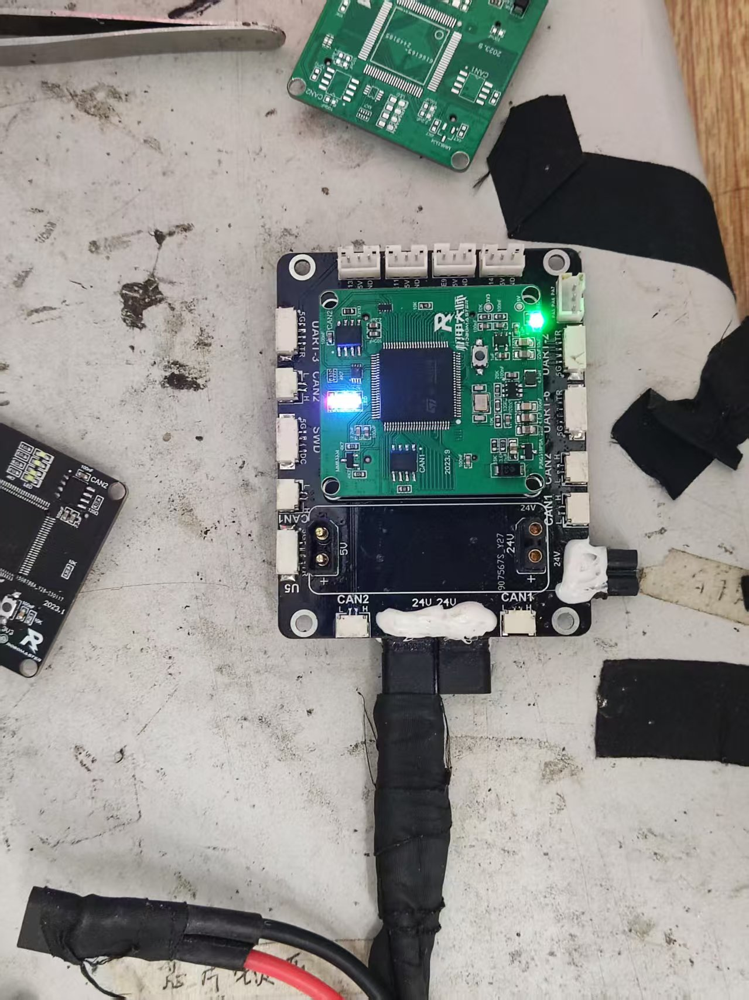
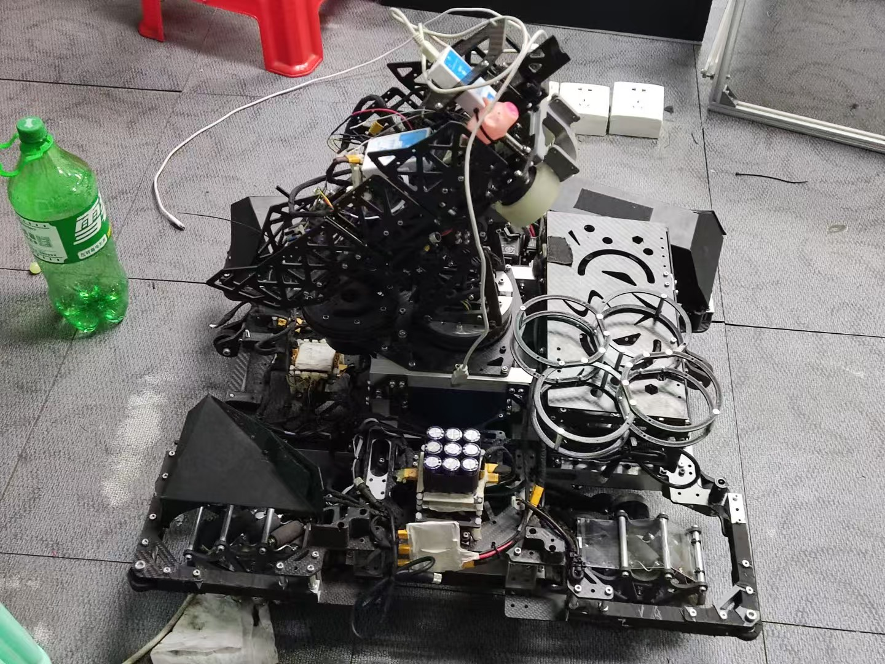
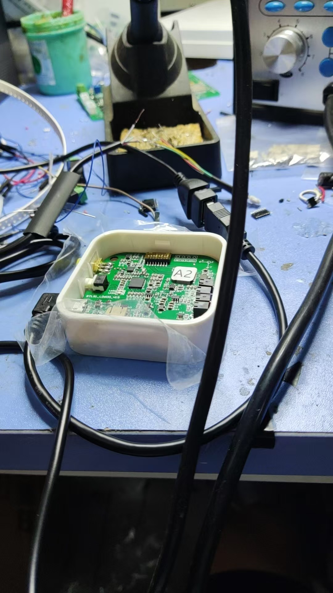
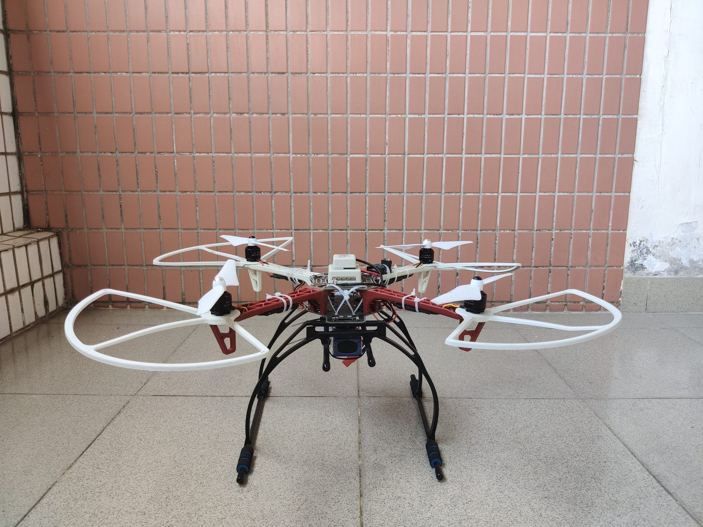

# Jiawei Jiang | Research Evidence Brief

> **Prospective MPhil Applicant** focused on wearable exoskeletons and embodied robotic systems.  
> Specializing in **hardware-level actuator control (FOC)** and **learning-based bipedal locomotion (Isaac Sim/RL)** to bridge the sim-to-real gap.

### Core Proof Points

- **Low-level Actuation:** Designed and validated a PCB-level FOC motor-drive board using SPC1168, DRV8300, MOSFET power stage, and SVPWM-based control workflow.
- **Robot Learning Workflows:** Explored both LeRobot-style manipulation training and TRON2 bipedal locomotion training, with emphasis on RL / IL workflow setup, reward tuning, and simulation-based debugging.
- **Hardware Reliability:** Hands-on experience in MCU / RK / RPi platform bring-up, power-path diagnosis, serial debugging, and board-level signal troubleshooting.

---

## 1. Actuation and Embedded Control: FOC Motor Drive Board

Evidence:
- [Motor rotation demo](assets/media/foc_motor_rotation_demo.mp4)
- [12V / power validation photo](assets/media/power_validation_12v.jpg)
- [Technical memo: FOC Motor Drive for Robotic Actuation](project_memos/FOC_Motor_Drive_for_Robotic_Actuation.md)

**Validation & Engineering Metrics**

| Category | Technical Specs & Implementation |
| :--- | :--- |
| **Hardware Core** | SPC1168 MCU, DRV8300 gate driver, custom MOSFET power stage |
| **Control Logic** | SVPWM, Clarke-Park transforms, FOC control workflow, current-sampling circuit design |
| **Test Results** | Completed board-level bring-up, preliminary motor-rotation validation, and multi-rail power validation with sub-1% measured error. |
| **Failure Analysis** | Debugged power-stage and board-level reliability issues during bring-up, including supply-path checks, soldering inspection, interface verification, and protection-circuit review. |

**Technical value:** This project is the primary evidence of actuator-level hardware implementation. It shows practical experience with compact robotic actuation, current sensing, PCB layout, and embedded control loops.

---

## 2. Robot Learning Workflows: LeRobot Manipulation and TRON2 Bipedal Training

Shared evidence:
- [Flat walking screenshot](assets/media/isaac_flat_walking.png)

### 2.1 LeRobot Manipulation Training

Technical scope:
- Explored LeRobot-style reinforcement learning and imitation learning workflows for robotic manipulation tasks.
- Focused on understanding policy-training structure, task setup, environment configuration, and data / demonstration flow.
- Built workflow-level familiarity that can transfer to future sim-to-real manipulation or embodied AI projects.

### 2.2 TRON2 Bipedal Locomotion Training

Technical scope:
- **Environment:** Isaac Sim + `tron2_rl_lab` workflow.
- **Reward terms tuned:**
  - **Step Clearance:** adjusted swing-foot clearance rewards to reduce low swing trajectories and foot-dragging tendency.
  - **Torso Posture & Gait Stability:** tuned posture and balance-related terms to improve continuous walking stability.
  - **Forward Motion / Tracking:** reviewed velocity-related reward curves and walking behavior to identify tracking instability.
- **Next-stage failure analysis:** Flat walking and slope traversal were achieved, while stair-crossing behavior still needs a staged curriculum. The current bottleneck is likely insufficient task decomposition between low-level gait stabilization and higher-level terrain progression.

**Technical value:** This section supports the robot-learning side of the portfolio from two angles: manipulation workflow literacy through LeRobot-style training, and locomotion-specific reward design through TRON2 / Isaac Sim bipedal training.

---

## 3. RoboMaster Robotics: Electrical Integration and Field Debugging

Evidence:
- [RM spare control boards and replacement modules](assets/media/rm_spare_control_boards.jpg)
- [RM wearable operator interface prototype](assets/media/rm_wearable_operator_interface.jpg)

**Key Contribution:** Participated in robot electrical integration, control-board replacement, power-distribution checks, and on-site hardware debugging for a competition robot platform.

**Technical value:** This evidence supports practical reliability under deadline pressure: board-level bring-up, connector / power-path troubleshooting, CAN / UART-oriented module integration, and rapid diagnosis when the robot system had to remain operational.

---

## 4. Field Robotics and Hardware Reliability (Supporting Evidence)

<b>Click to expand: Embedded Diagnostics, UAV Inspection, Agricultural Robotics, and Publication Evidence</b>

 

### Embedded Hardware Diagnostics and Board Bring-Up

Evidence:
- [Linux embedded platform debugging](assets/media/linux_embedded_platform_debug.jpg)
- [MCU board bring-up](assets/media/mcu_board_bringup.jpg)

**Key Contribution:** MCU / RK / RPi platform bring-up, serial debugging, power-path diagnosis, and board-level fault isolation using multimeters, oscilloscopes, adjustable power supplies, and load instruments.

### Sugarcane Harvester & UAV Inspection Systems

Evidence:
- [Sugarcane monitoring system](assets/media/sugarcane_monitoring_system.jpg)
- [Cabbage harvester CAN / motor-control evidence](assets/media/cabbage_harvester_can_motor_control.jpg)
- [SPIE mine robot publication evidence](assets/media/spie_mine_robot_publication.jpg)

**Key Contribution:** Embedded flight-control logic, telemetry communication, multi-sensor acquisition, CAN communication exposure, and field-oriented robotic system deployment.

**Publication:** Co-authored work related to agricultural machinery monitoring in *Chinese Agricultural Mechanization*. Third author on an SPIE Proceedings paper involving an STM32-based multi-sensor mobile robot.

